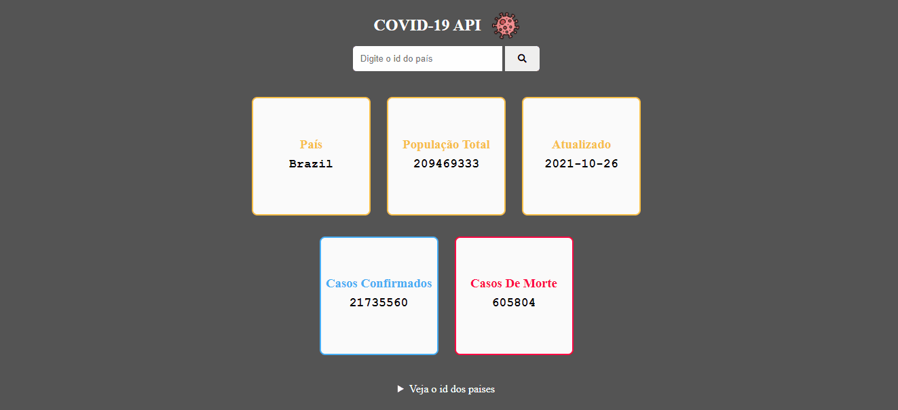
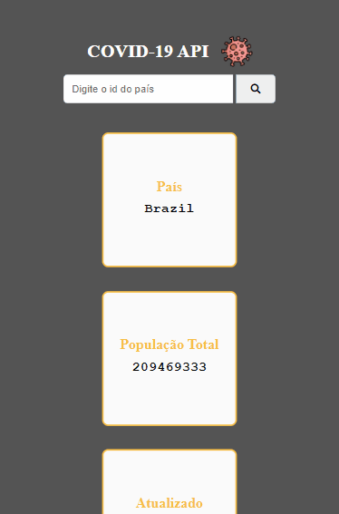

# API COVID-19

### Esse projeto foi desenvolvido para consumir dados de uma API!

- Foi usado o fetch para fazer o cosumo da API COVID-19!
- Por meio desse projeto pode-se ver os dados de mais de 200 paises pelo o mundo!
- Pode-se ver os casos confirmados!
- Os casos que levaram a morte e muito mais!

### Layout para notebook e desktop

### Layout para celulares e tablets

🚀Tecnologias usadas:
- ✔HTML
- ✔CSS
- ✔JAVASCRIPT

